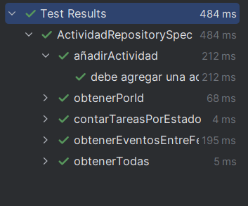

## Descripción de Code Smells y Patrones de Refactorización

### Code Smells Detectados
## 1. Detección de code smells

A continuación se describen al menos cinco code smells identificados mediante análisis manual y con la ayuda de un linter (por ejemplo, Detekt en Kotlin):

1. **Large Class** en `ActividadRepository.kt`:  
   La clase acumula múltiples responsabilidades (gestión de tareas y eventos) y métodos de conteo/filtrado.  

2. **Long Method** en métodos de conteo (p.ej., `contarTareasPorEstado`) y filtrado (`obtenerEventosEntreFechas`):  
   La lógica de filtrado y conteo podría extraerse en métodos auxiliares para mejorar legibilidad.
   
3. **Feature Envy** en `contarTareasConSubtareas`:  
   El repositorio accede a detalles internos de `Tarea` (lista de subtareas) en lugar de delegar la lógica a la clase `Tarea`.  
   

4. **Primitive Obsession** en el uso de `String` para fechas (`inicio: String`, `fin: String`):  
   Se deberían usar tipos más adecuados (por ejemplo, `LocalDate`) para evitar parsing/formatos dispersos.  
   

5. **Duplicate Code** en filtrados de actividades (varios `.filterIsInstance<>()` y comparaciones de fecha):  
   Patrón repetido en diferentes métodos, derivando en código redundante.  
 


## 2. Patrones de refactorización aplicados

Se han seleccionado y aplicado tres patrones de refactorización distintos mediante la funcionalidad del IDE (Refactor > ...):

### 2.1. Extracción de Método (Extract Method)

- **Objetivo:** Separar la lógica de filtrado de actividades en métodos privados para `Tarea` y `Evento`.  
- **Antes:** Lógica inline en `contarTareasPorEstado` y `obtenerEventosEntreFechas`.  
- **Después:** Métodos privados `filtrarTareasPorEstado(estado: EstadoTarea)` y `filtrarEventosEntre(inicio: LocalDate, fin: LocalDate)`.  

### 2.2. Introducir Objeto Parámetro (Introduce Parameter Object)

- **Objetivo:** Reemplazar los parámetros `inicio: String` y `fin: String` por un objeto `RangoFechas` que encapsula dos `LocalDate`.  
- **Antes:** Métodos `obtenerEventosEntreFechas(inicio: String, fin: String)` en `IActividadRepository`.  
- **Después:** `obtenerEventosEntreFechas(rango: RangoFechas)` con validación centralizada de rangos.  


### 2.3. Simplificar Condicional (Simplify Conditional)

- **Objetivo:** Reducir la complejidad de condiciones en conteo de subtareas.  
- **Antes:** `count { it.obtenerSubtareas().isNotEmpty() }`.  
- **Después:** Delegar a método `tieneSubtareas()` dentro de `Tarea`, reemplazando la condición por `count { it.tieneSubtareas() }`.  

---

## Pruebas Unitarias Asociadas

| Bloque (`describe`)                  | Caso de prueba (`it`)                                           | Acción realizada                                                | Resultado esperado                                         |
|--------------------------------------|-----------------------------------------------------------------|-----------------------------------------------------------------|------------------------------------------------------------|
| **añadirActividad**                  | debe agregar una actividad a la lista                           | Se llama a `repo.aniadirActividad(tarea)`                       | Verifica que `aniadirActividad(tarea)` fue invocado       |
| **obtenerPorId**                     | debe retornar la actividad correcta si existe                   | Se simula `repo.obtenerPorId(any())` devolviendo `tarea`; luego se invoca con `1` | Devuelve el objeto `tarea`                                  |
| **obtenerPorId**                     | debe retornar null si no existe                                 | Se simula `repo.obtenerPorId(any())` devolviendo `null`; luego se invoca con `999` | Devuelve `null`                                            |
| **contarTareasPorEstado**           | debe contar tareas en estado ABIERTA                            | Se simula `repo.contarTareasPorEstado(EstadoTarea.ABIERTA)` devolviendo `3`; luego se invoca con `ABIERTA` | Devuelve `3`                                              |
| **obtenerEventosEntreFechas**        | debe filtrar eventos entre fechas                               | Se simula `repo.obtenerEventosEntreFechas("2025-01-01","2025-12-31")` devolviendo `[evento]`; luego se invoca con ese rango | Devuelve lista conteniendo solo `evento`                  |
| **obtenerTodas**                     | debe retornar todas las actividades                             | Se simula `repo.obtenerTodas()` devolviendo `[tarea, evento]`; luego se invoca `repo.obtenerTodas()` | Devuelve lista con `[tarea, evento]`                       |


---

### Prueba de depuracion


## Respuestas a las Preguntas

### [1]
-1.a ¿Qué code smell y patrones de refactorización has aplicado?  
Los patrones a refactorizacion utilizados fueron mediante la funcionalidad del IDE,subdividiendo las funciones habidas (en la medida de lo posible) para una mejor lectura y comprension  

-1.b Teniendo en cuenta aquella funcionalidad que tiene pruebas unitarias, selecciona un patrón de refactorización de los que has aplicado y que están cubierto por los test unitarios. ¿Porque mejora o no mejora tu código? Asegurate de poner enlaces a tu código

-Antes
```kotlin
fun contarTareasPorEstado(estado: EstadoTarea): Int {
    return actividades.filterIsInstance<Tarea>()
                     .count { it.estado == estado && it.subtareas.any() }
}
```
-Ahora
https://github.com/Agsergio04/ED_Mis_ninios_Scrum_Task_Manager-/blob/e67eff866532ec28a20d5645c31510d5ec3d249c/src/main/kotlin/datos/ActividadRepository.kt#L23-L35

se subdivido la funcion en funciones mas simples por motivos de legibilidad y reutilizacion encaso de futuras extensiones 
### [2]
-2.a Describe el proceso que sigues para asegurarte que la refactorización no afecta a código que ya tenias desarrollado.

Para asegurar de que la refactorizacion no afecta a la estructura del proyecto me asegure de hacer pruebas unitarias mediante mockk  
Siendo estos los resultados:


### [3]
-3.a ¿Que funcionalidad del IDE has usado para aplicar la refactorización seleccionada? Si es necesario, añade capturas de pantalla para identificar la funcionalidad.
La funcionalidad de Refactorizar lineas de codigo y en su defecto el importe de las clases a la hora de realizar las pruebas unitarias
