# Alfonso Castejón Moreno 1DAWB 

## Descripción: 
### La actividad consiste en instalar y usar un analizador de código estático (Detekt o Ktlint) en el proyecto que vienes desarrollando, capturar evidencias gráficas, detectar y clasificar errores, aplicar soluciones y explorar las posibilidades de configuración de la herramienta elegida. 
### enlace al repositorio actualizado: https://github.com/Agsergio04/ED_Mis_ninios_Scrum_Task_Manager-/tree/AJCM_Linting/src/main/kotlin
### enlace al repositorio sin actualizar: https://github.com/Agsergio04/ED_Mis_ninios_Scrum_Task_Manager-/tree/master/src/main/kotlin

## Instalación KTLINT 
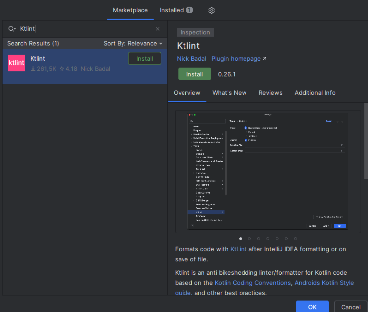 
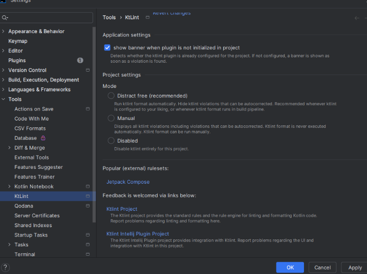 

## 1 Falta una coma al final del último parámetro en una declaración multilínea.  
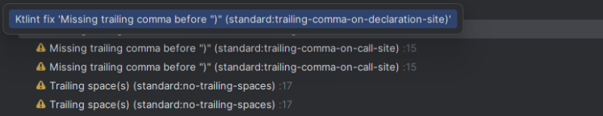 
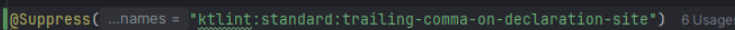 

## 2 Importación sin uso 
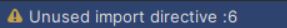 
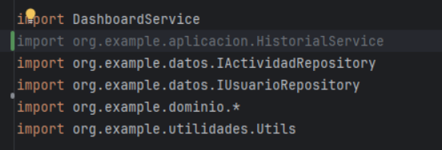 
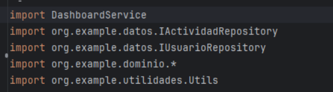 

## 3 Variable sin uso 
 
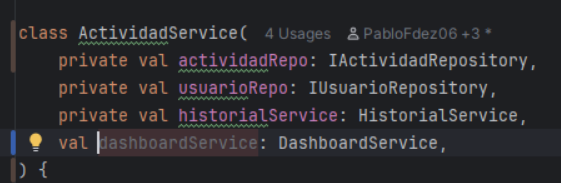 
 

## 4 Espacios innecesarios
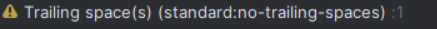 
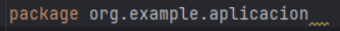 
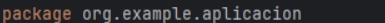 

## 5 Usas una importación comodín
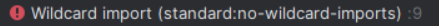 
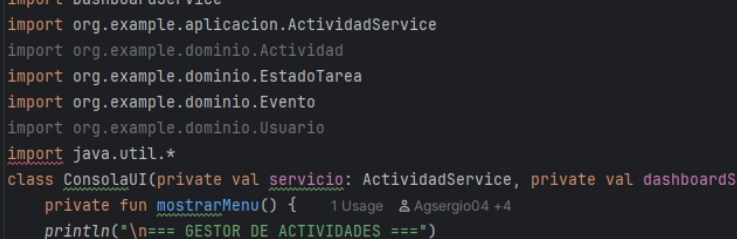 
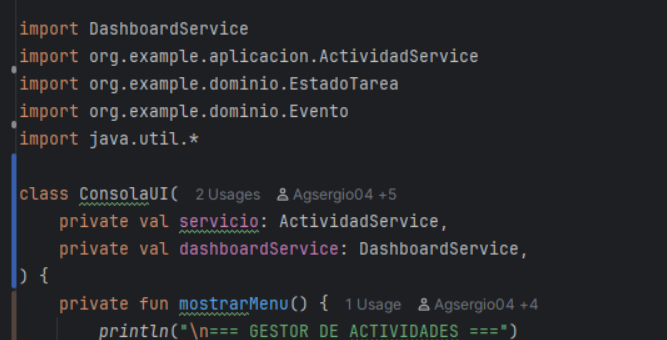 

## Modificación de configuración: Wildcard Imports en Detekt
- Regla: WildcardImport controla el uso de imports con *.
- Por defecto: está activa, lo que prohíbe usar wildcard imports.
- Cambio: para permitir wildcard imports:
``
style:
WildcardImport:
active: false
``

# [1] 
## 1.a ¿Que herramienta has usado, y para que sirve? 
### He utilizado la herramienta ktlint, y sirve para  para analizar y formatear automáticamente el código. 
## 1.b ¿Cuales son sus características principales? 
### Linter, formateador, sigue las reglas de estilo de Kotlin, fácil integración con IDEs, detecta errores comunes de estilo. 
## 1.c ¿Qué beneficios obtengo al utilizar dicha herramienta? 
### Más fácil y rápido de ordenar código que si lo haces a mano. 
# [2] 
## 2.a De los errores/problemas que la herramienta ha detectado y te ha ayudado a solucionar, ¿cual es el que te ha parecido que ha mejorado más tu código? 
### Eliminar importaciones que no son útiles. 
## 2.b ¿La solución que se le ha dado al error/problema la has entendido y te ha parecido correcta? 
### Si, ya que ayuda a limpiar código. 
## 2.c ¿Por qué se ha producido ese error/problema? 
### Por no realizar buenas practicas en el código. 
# [3] 
## 3.a ¿Que posibilidades de configuración tiene la herramienta? 
### - Desactivar reglas específicas vía .editorconfig 
### - Permitir o prohibir wildcard imports (import *) 
### - Ajustar el tamaño de tabulación (espacios vs tabs) 
## 3.b De esas posibilidades de configuración, ¿cuál has configurado para que sea distinta a la que viene por defecto? 
### - Permitir o prohibir wildcard imports (import *) 
## 3.c Pon un ejemplo de como ha impactado en tu código, enlazando al código anterior al cambio, y al posterior al cambio, 
### han disminuido todas las alertas que aparecían, como se ven en las imágenes y en los enlaces de esta tarea. 
# [4] 
## 4 ¿Qué conclusiones sacas después del uso de estas herramientas? 
### Es una herramienta muy útil si quieres mejorar la legibilidad del código y minimizar errores. 
