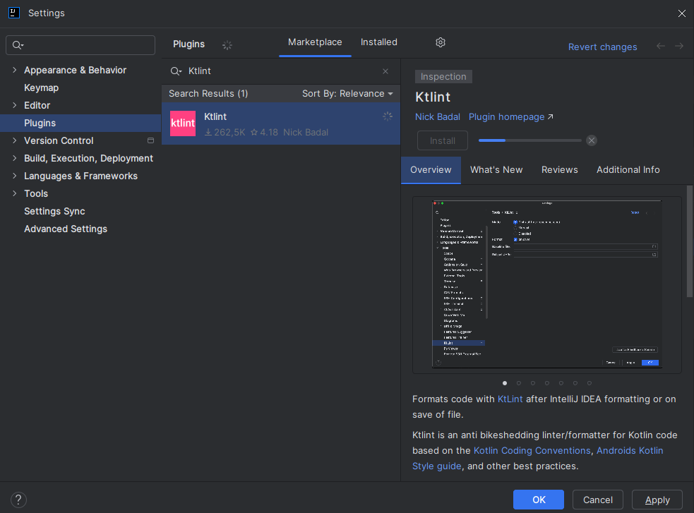
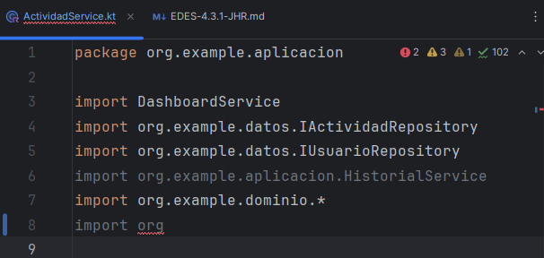
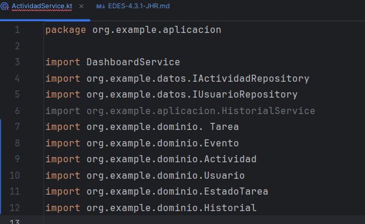
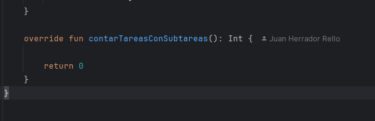
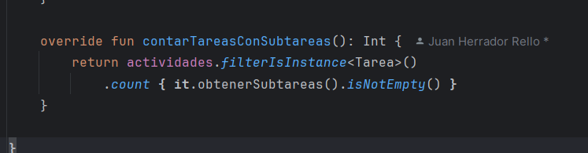
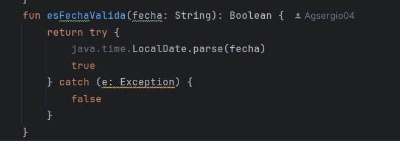
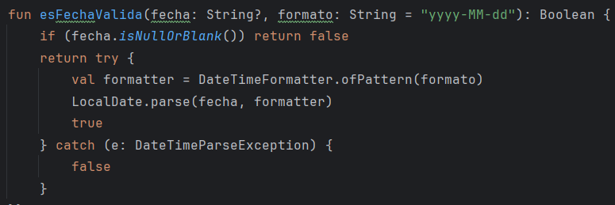

# Instalacion de Detekt o Ktlint

Instalaremos el programa Ktlint:

- Nos vamos a la rueda de ajustes y le damos a Plugins.

- Buscamos Ktlint y le damos a instalar.

- Una vez instalado tendremos que reiniciar el ID.

# 5 Tipos de errores

- 1

No es recomendable importar con * porque puede ocultar dependencias no utilizadas y hace el codigo menos claro

Aqui lo que he hecho es definir cada depencencia para que sea mas claro y menos lioso

- 2

Este metodo no esta implementando correctamente. No cuenta cuantas tareas tienen subtareas asociadas

Ahora si cuenta cuantas tareas tienen subtareas asociadas

- 3

El catch (e: Exception) es demasiado general y puede ocultar otros errores en el codigo

Ahora se captura el error DataTimeParseExceptio.

- 4

# 1 Preguntas

- 1.a ¿Que herramienta has usado, y para que sirve?

He usado ktlint y sirve para ver errores de estilo en el codigo Kotlin, como problemas de formato, espacios, orden de import, etc

- 1.b ¿Cuales son sus características principales?

Detecta errores de formato y estilo
Puede autocorregir ciertos problemas comunes
Se integra facilmente con Gradle, IntelliJ

- 1.c ¿Qué beneficios obtengo al utilizar dicha herramienta?

Me ayuda a mantener el codigo limpio, ordenado y mas facil de leer

# 2

- 2.a De los errores/problemas que la herramienta ha detectado y te ha ayudado a solucionar, ¿cual es el que te ha parecido que ha mejorado más tu código?

El de los import con asteerisco(*) Ktlint me hizo reemplazarlos por import especificos, lo que hizo que el codigo se viera mas claro

- 2.b ¿La solución que se le ha dado al error/problema la has entendido y te ha parecido correcta?

Si, fue facil de entender

- 3.c ¿Por qué se ha producido ese error/problema?

Por que usar (*) en los import es mala practica. Puede importar mas cosas de las necesarias y gacer el codigo mas confuso

# 3

- 3.a ¿Que posibilidades de configuración tiene la herramienta?

Puedes mostrar errores en consola, elegir el color del texto, activar o desactivar reglas y usar un archivo .editorconfig para ajustar estilos

- 3.b De esas posibilidades de configuración, ¿cuál has configurado para que sea distinta a la que viene por defecto?

- 3.c Pon un ejemplo de como ha impactado en tu código, enlazando al código anterior al cambio, y al posterior al cambio,

# 4

- 4.a ¿Qué conclusiones sacas después del uso de estas herramientas?

# 1

- 1.a ¿Que herramienta has usado, y para que sirve?

He usado ktlint y sirve para ver errores de estilo en el codigo Kotlin, como problemas de formato, espacios, orden de import, etc

- 1.b ¿Cuales son sus características principales?

Detecta errores de formato y estilo
Puede autocorregir ciertos problemas comunes
Se integra facilmente con Gradle, IntelliJ

- 1.c ¿Qué beneficios obtengo al utilizar dicha herramienta?

Me ayuda a mantener el codigo limpio, ordenado y mas facil de leer

# 2

- 2.a De los errores/problemas que la herramienta ha detectado y te ha ayudado a solucionar, ¿cual es el que te ha parecido que ha mejorado más tu código?

El de los import con asteerisco(*) Ktlint me hizo reemplazarlos por import especificos, lo que hizo que el codigo se viera mas claro

- 2.b ¿La solución que se le ha dado al error/problema la has entendido y te ha parecido correcta?

Si, fue facil de entender

- 3.c ¿Por qué se ha producido ese error/problema?

Por que usar (*) en los import es mala practica. Puede importar mas cosas de las necesarias y gacer el codigo mas confuso

# 3

- 3.a ¿Que posibilidades de configuración tiene la herramienta?

Puedes mostrar errores en consola, elegir el color del texto, activar o desactivar reglas y usar un archivo .editorconfig para ajustar estilos

- 3.b De esas posibilidades de configuración, ¿cuál has configurado para que sea distinta a la que viene por defecto?

- 3.c Pon un ejemplo de como ha impactado en tu código, enlazando al código anterior al cambio, y al posterior al cambio,

# 4

- 4.a ¿Qué conclusiones sacas después del uso de estas herramientas?
