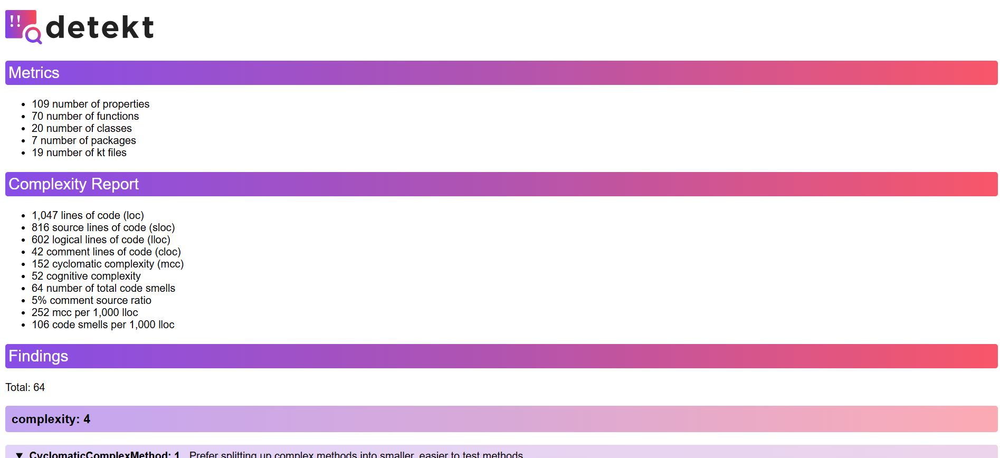

# Práctica: Analizador Estático de Código con Detekt

## Herramienta utilizada

He utilizado **[Detekt](https://detekt.dev/)** como analizador estático de código para mi proyecto Kotlin. Esta herramienta me ha permitido identificar posibles errores de estilo, diseño y mantenimiento en el código.

---

## Proceso de instalación

1. Añadí el plugin de Detekt en el archivo `build.gradle.kts`:
```kotlin
plugins {
    id("io.gitlab.arturbosch.detekt") version "1.23.0"
}
```

2. Creé el archivo de configuración `detekt.yml` en la raíz del proyecto.

3. Ejecuté el análisis con:
```bash
./gradlew detekt
```

4. Tomé capturas de pantalla del análisis ejecutado correctamente y del listado de errores encontrados.





---

## Errores detectados y correcciones

He elegido estos cinco errores para realizar esta práctica:

### 1. CyclomaticComplexMethod

- **Descripción**: El método `filtrarActividades` tenía una complejidad ciclomática de 16.
- **Impacto**: Métodos muy complejos son difíciles de entender, mantener y probar. Un alto número de decisiones (`if`, `when`, etc.) en una sola función puede ocultar errores lógicos y dificultar la evolución del código.
- **Solución**: Dividí partes de la lógica en funciones auxiliares, reduciendo así la carga cognitiva y facilitando su testeo individual.

**Antes**:
```kotlin
fun filtrarActividades(...) = actividades.filter { act ->
    val coincideTipo = ...
    val coincideEstado = ...
    val coincideEtiquetas = ...
    val coincideUsuario = ...
    val coincideFecha = ...
    coincideTipo && coincideEstado && coincideEtiquetas && coincideUsuario && coincideFecha
}
```

**Después**:
```kotlin
fun filtrarActividades(...) = actividades.filter { act ->
    coincideTipo(act, tipo) &&
    coincideEstado(act, estado) &&
    coincideEtiquetas(act, etiquetas) &&
    coincideUsuario(act, usuario) &&
    coincideFecha(act, fechaFiltro)
}
```

### 2. EmptyDefaultConstructor

- **Descripción**: Constructor vacío innecesario.
- **Impacto**: Añadir un constructor sin lógica en Kotlin es redundante y puede confundir a otros desarrolladores sobre su propósito.
- **Solución**: Eliminé los paréntesis para seguir la convención de código limpia.

**Antes**:
```kotlin
class ActividadRepository() : IActividadRepository
```

**Después**:
```kotlin
class ActividadRepository : IActividadRepository
```

### 3. PackageDeclarationMismatch

- **Descripción**: Declaración de paquete no coincidía con la ubicación real del archivo `Main.kt`.
- **Impacto**: Esto puede causar errores de compilación y problemas al ejecutar el programa, especialmente al usar herramientas de empaquetado o CI/CD.
- **Solución**: Eliminé la declaración incorrecta para que el archivo se compile y se ejecute correctamente.

**Antes**:
```kotlin
package org.example
```

**Después**:
(No se incluye declaración de paquete)

### 4. UnusedPrivateProperty

- **Descripción**: La propiedad `fechaCreacion` no se utilizaba.
- **Impacto**: Mantener propiedades no utilizadas aumenta el ruido en el código y puede confundir a otros desarrolladores, dando la impresión de que son relevantes cuando no lo son.
- **Solución**: Eliminé la propiedad del constructor para mantener el código limpio y preciso.

**Antes**:
```kotlin
private val fechaCreacion: String,
```

**Después**:
(Esta línea fue eliminada)

### 5. TooGenericExceptionCaught

- **Descripción**: Captura de excepción demasiado genérica (`Exception`).
- **Impacto**: Capturar `Exception` impide distinguir entre tipos de errores, ocultando errores críticos o inesperados. Es mejor capturar excepciones específicas para mantener el control del flujo de errores.
- **Solución**: Cambié a una excepción específica (`IllegalArgumentException`).

**Antes**:
```kotlin
} catch(e: Exception) {
    println("Error al crear usuario: ${e.message}")
}
```

**Después**:
```kotlin
} catch(e: IllegalArgumentException) {
    println("Nombre inválido: ${e.message}")
}
```


### Resultado tras correcciones:

Después de implementar las correciones, ejecuté de nuevo la herramienta para comprobar si había conseguido reducir en 5 los errores encontrados, y justo así fue. He conseguido pasar de 64 a 59 errores encontrados.


---

## Personalización de configuración

Modifiqué el archivo `detekt.yml` para permitir una complejidad máxima de métodos de 16 en lugar del valor por defecto (15):

```yaml
complexity:
  CyclomaticComplexMethod:
    active: true
    threshold: 16
```

Esto permitió que métodos con hasta 16 puntos de decisión fueran aceptables sin causar fallo en la compilación, dando algo más de flexibilidad al desarrollo sin comprometer la mantenibilidad.


---

## Preguntas de Reflexión

### [1] Sobre la herramienta utilizada

**1.a ¿Qué herramienta has usado, y para qué sirve?**  
He utilizado **Detekt**, una herramienta de análisis estático de código diseñada específicamente para proyectos escritos en Kotlin. Sirve para detectar errores comunes, code smells, malas prácticas, complejidad innecesaria y estilos de codificación inconsistentes.

**1.b ¿Cuáles son sus características principales?**  
- Detecta automáticamente problemas de estilo y complejidad.  
- Se integra fácilmente en proyectos con Gradle.    
- Permite generar informes en distintos formatos (HTML, XML, TXT).  
- Se puede extender con reglas personalizadas.

**1.c ¿Qué beneficios obtengo al utilizar dicha herramienta?**  
Los principales beneficios son:
- Mejora la calidad y mantenibilidad del código.
- Detecta errores antes de tiempo, reduciendo problemas en producción.
- Asegura consistencia en el estilo del proyecto.
- Ahorra tiempo en revisiones manuales de código.


### [2] Análisis de los errores detectados

**2.a ¿Cuál es el error que más ha mejorado tu código?**  
La refactorización de la función `filtrarActividades`, que superaba el umbral de complejidad ciclomática. Al dividirla en funciones auxiliares más pequeñas, el código se volvió más legible, reutilizable y testeable.

**2.b ¿La solución te ha parecido correcta y la has entendido?**  
Sí, he comprendido por qué el método era problemático. Al separar la lógica en funciones con responsabilidad única, el código es más claro y cumple el principio de responsabilidad única (SRP).

**2.c ¿Por qué se produjo ese error?**  
Se produjo porque se acumuló demasiada lógica en una sola función. Esto es un anti-patrón común y Detekt lo señala para fomentar la modularización y la simplicidad.


### [3] Sobre la configuración de Detekt

**3.a ¿Qué posibilidades de configuración tiene la herramienta?**  
Permite activar/desactivar reglas, modificar umbrales (por ejemplo, de complejidad o longitud), ignorar rutas específicas y establecer reglas personalizadas en el archivo `detekt.yml`.

**3.b ¿Qué configuración has cambiado respecto a la que viene por defecto?**  
He modificado el umbral de la regla `CyclomaticComplexMethod` de `15` a `16` para evitar que Detekt lanzara un error por una función que estaba justo en el límite de complejidad.

**3.c Ejemplo del impacto en el código**  
- Antes del cambio, Detekt mostraba un error en la función `filtrarActividades`.  
- Después del ajuste del umbral, ese error desapareció, aunque decidí refactorizar igualmente la función.  
  - Fragmento original: función con 16 puntos de complejidad.  
  - Fragmento final: la lógica fue dividida en funciones como `coincideTipo`, `coincideEstado`, etc., cumpliendo con mejores prácticas de diseño.


### [4] Conclusión

Tras el uso de Detekt, he comprendido el valor que aporta un analizador de código estático en proyectos reales. No solo automatiza la detección de errores y malas prácticas, sino que también guía hacia un desarrollo más limpio, modular y mantenible. Me ha parecido especialmente útil como complemento a las revisiones de código, y me gustaría integrarlo desde el inicio en futuros proyectos.
