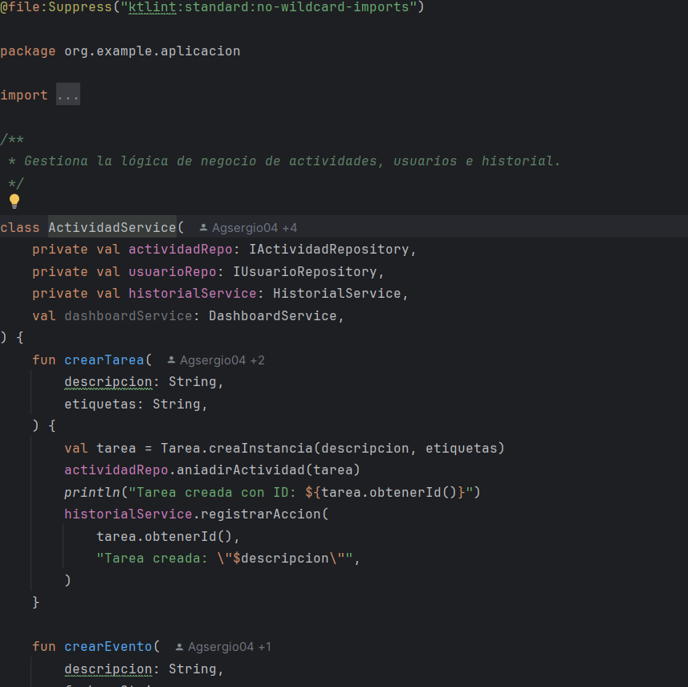

# Actividad: Analizadores de código estático: Linting (RA4.cd)

## Instalacion 
Para la instalacion he instalado el plugin de la Marketplace de IntelliJ  

.png)
.png)
.png)

Tras la instalacion y ejecutar el siguiente comando:  
```bash 
./ktlint "**/*.kt"
```
Encontro los siguientes Problemas:  

### 1Espacios incesesarios:  
  
### 2Existencia de espacios entre funciones de la Interfaz  
  
### 3Desactiva el formato de multilinea  
  
### 4Prohibe la Implementacion de comodines
  
### 5Error de Sintaxis y escritura de una clase  
  

Con su respectiva correcion:  

### Solucion 1:  
.png)  
### Solucion 2:  
.png)  
### Solucion 3:  
.png)  
### Solucion 4:  
.png)  
### Solucion 5:  
.png)  

---

## Respondiendo Preguntas

## [1]  
### 1.a ¿Que herramienta has usado, y para que sirve?   
  He utilizado Ktlint a la hora de la correcion de mi repositorio,sirve para la organizacion y formateo de codigo que no cumple con los estandares de Ktlint  
### 1.b ¿Cuales son sus características principales?  
 Las caracteristicas principales de Ktlint son :     
 -Linter    
 -formateador       
 -Sufácil integración con IDEs    
 -Deteccion errores comunes de estilo    

### 1.c ¿Qué beneficios obtengo al utilizar dicha herramienta?  
La facilidad de organizar tu codigo  
## [2]  
### 2.a De los errores/problemas que la herramienta ha detectado y te ha ayudado a solucionar, ¿cual es el que te ha parecido que ha mejorado más tu código?  
  Estoy entre la eliminacion de importes inutiles junto a la estructuracion del codigo para que sea mas agradable a la vista  
### 2.b ¿La solución que se le ha dado al error/problema la has entendido y te ha parecido correcta?  
  La he entendido pero hay ciertas caracterisitcas como el formato multiple que la verdad dicho formato me ayuda a ver con mas claridad las funcionalidades que requieren de varios parametros
### 2.c ¿Por qué se ha producido ese error/problema? 
  Por mala organizacion junto a malas practicas del codigo
## [3]  
3.a ¿Que posibilidades de configuración tiene la herramienta?   
- Desactivar reglas especificas por medio de .editorconfig  
- Permitir o prohibir wildcard imports (*)  
- Ajustar el tamaño de las tabulaciones   
3.b De esas posibilidades de configuración, ¿cuál has configurado para que sea distinta a la que viene por defecto?  
- Niguan la verdad,queria que fuese la predefinida del ktlint        
3.c Pon un ejemplo de como ha impactado en tu código, enlazando al código anterior al cambio, y al posterior al cambio  
-Antes:  
  
-Despues:  
.png)      
[4]    
4 ¿Qué conclusiones sacas después del uso de estas herramientas?  
Que es una herramienta practica a la hora de la organizacion del codigo y la implementacion de buenas practicas de programacion
---

## Paginas utilizadas

-Los addons de IntelliJ

-[Ktlint](https://pinterest.github.io/ktlint/latest/)

