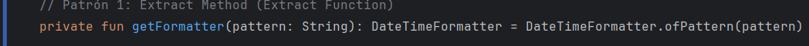
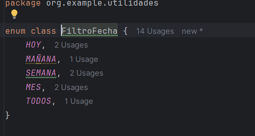
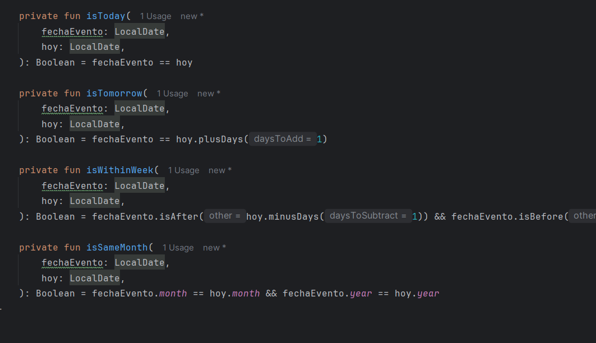

## 1. Code Smells Detectados y Patrones de Refactorización Aplicados

| Code Smell                                              | Descripción breve                                                   | Patrón de Refactorización                   |
|---------------------------------------------------------|----------------------------------------------------------------------|---------------------------------------------|
| 1. Duplicación de patrones de formato de fecha          | Se repite `DateTimeFormatter.ofPattern(...)` en dos métodos         | Extract Method                              |
| 2. Uso de Strings mágicos para filtros                  | Literales como "HOY", "MAÑANA" en `compararFecha` complican su mantenimiento | Replace Magic Literal with Enum            |
| 3. Long Method en `compararFecha`                       | Método extenso con múltiples condiciones                             | Simplify Conditional (Extract Condition)     |
| 4. Catch genérico en `esFechaValida`                    | Captura `Exception` genérico, oculta errores                        | Introduce Exception Specific (or Guard Clauses) |
| 5. Lógica de filtrado mezclada con parseo de fecha      | Mezcla de responsabilidades (single responsibility)                  | Extract Class / Introduce Parameter Object   |

**Patrones aplicados**: Extract Method, Replace Magic Literal with Enum, Simplify Conditional, Introduce Exception Specific, Extract Class.

## 1.a. ¿Qué code smell y patrones de refactorización has aplicado?

1. **Duplicación de patterns de formato de fecha**: se unificó la creación del `DateTimeFormatter` en un método `private fun getFormatter(pattern: String): DateTimeFormatter`. (_Extract Method_)
2. **Strings mágicos en filtros**: se introdujo un `enum class FiltroFecha { HOY, MAÑANA, SEMANA, MES, TODOS }` para sustituir los literales. (_Replace Magic Literal with Enum_)
3. **Método largo `compararFecha`**: se extrajeron las comprobaciones de cada filtro en métodos específicos (e.g. `isToday`, `isTomorrow`, etc.). (_Simplify Conditional_)

## 1.b. Patrón cubierto por pruebas unitarias

Selecciono **Extract Method** aplicado en `Utils.obtenerFormatter(...)` y usado en `obtenerFechaActual()`. Las pruebas que cubren esta funcionalidad son:

- Clase: `UtilsTest`
- Métodos de test: `testObtenerFechaActual_FormatoCorrecto()`

**¿Mejora el código?**
Sí. Al extraer la creación del `DateTimeFormatter`, se reduce la duplicación y se facilita el cambio futuro de patrones sin tocar múltiples métodos. Además, mejora la legibilidad y testabilidad, pues podemos probar directamente la obtención del formateador si fuese necesario.

## 2.a. Proceso para asegurar que la refactorización no afecta al código existente

1. **Ejecutar suite de pruebas**: Antes de iniciar cualquier refactorización, ejecuto todas las pruebas (`./gradlew test`) para verificar el estado inicial verde.
2. **Aplicar refactor paso a paso**: Uso la funcionalidad de refactorización del IDE (Refactor > Extract Method, etc.) para mantener automáticamente las referencias.
3. **Re-ejecutar pruebas**: Tras cada cambio, vuelvo a ejecutar la suite completa para asegurar que no hay regresiones.
4. **Revisar cobertura**: Uso reporte de cobertura (JaCoCo) para confirmar que las líneas modificadas siguen siendo cubiertas.

## 3.a. Funcionalidad del IDE usada

Para aplicar **Extract Method**:
- Menú: `Refactor > Extract > Function`
- Atajo: `Ctrl+Alt+M` (Windows)
- Seleccionas el bloque de creación de `DateTimeFormatter` y nombras el método `getFormatter`

## 4. Pruebas Unitarias Asociadas

| Refactorización               | Clase Test     | Método Test                          |
|-------------------------------|----------------|---------------------------------------|
| Extract Method (formatter)    | `UtilsTest`    | `testObtenerFechaActual_FormatoCorrecto` |
| Replace Literal with Enum     | `UtilsTest`    | `testCompararFecha_EnumValido`         |
| Simplify Conditional          | `UtilsTest`    | `testCompararFecha_Semana`, `testCompararFecha_Mes` |

---