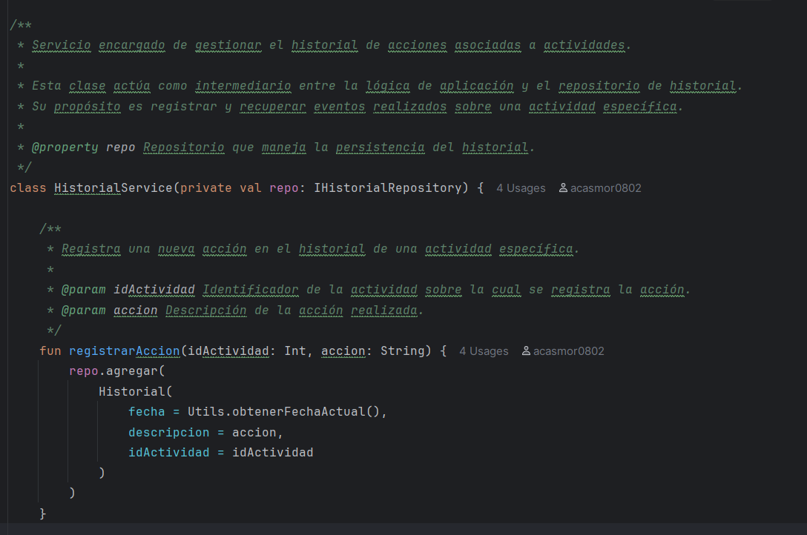
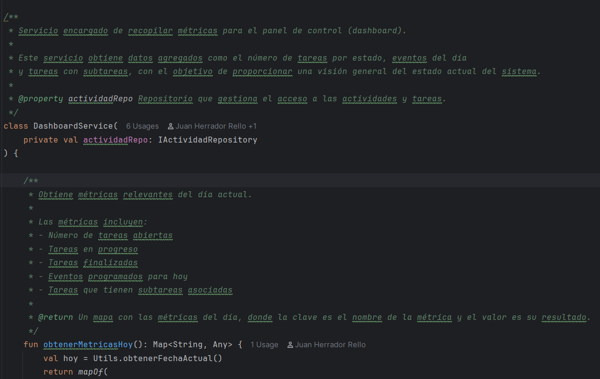
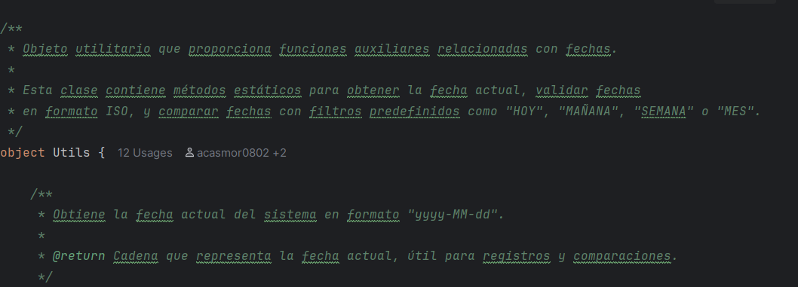
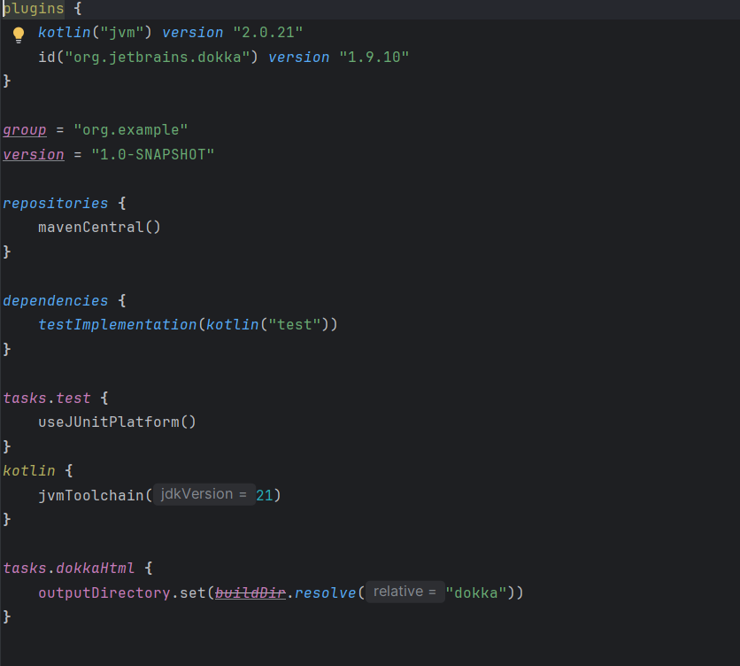
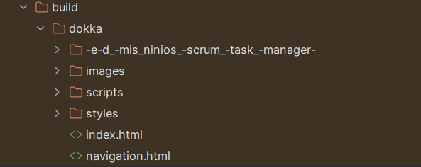
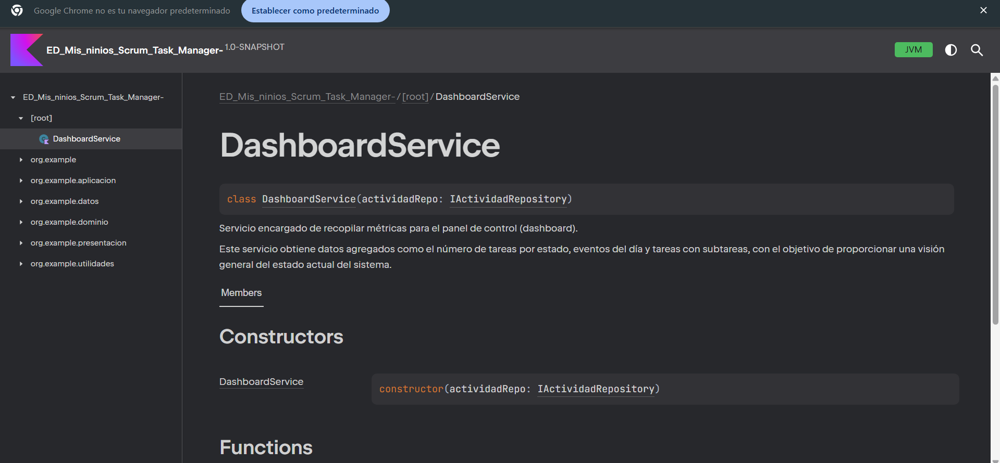
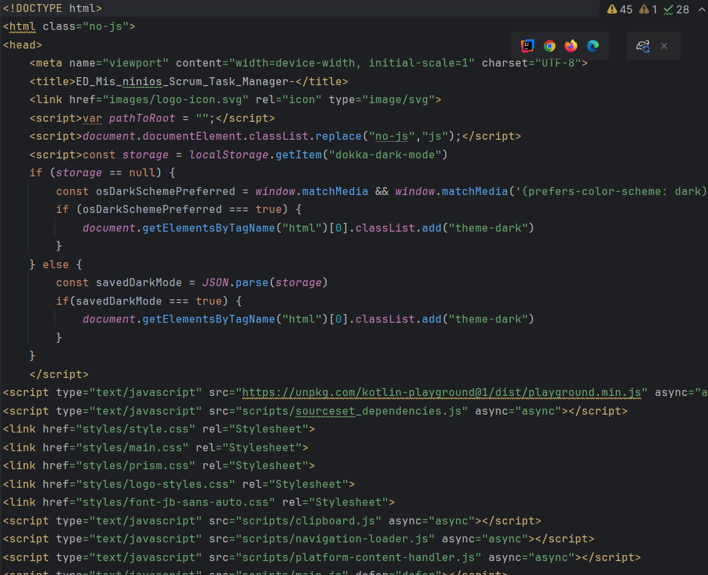

# Actividad 4.4.1: Documentación de Clases con KDoc y Dokka en Kotlin

**Agrupamiento:** Individual  
**ID actividad:** 4.4.1

## Descripción

Documentar el código fuente del proyecto Kotlin utilizando KDoc y generar la documentación en formato HTML (u otro) con Dokka. Integrar el flujo de generación desde el IDE y/o línea de comandos.

## Objetivos

1. Añadir bloques KDoc (`/** … */`) en al menos tres clases, describiendo propósitos y usos.
2. Configurar y ejecutar Dokka para generar la documentación completa del proyecto.
3. Integrar la generación en el IDE y línea de comandos.
4. Incluir capturas del código comentado y del resultado HTML.
5. Documentar el proceso en un informe Markdown.

---

## 1. Comentarios KDoc

Se documentaron tres clases del proyecto: `HistorialService`, `DashboardService` y `Utils`. A continuación, extractos con los bloques KDoc:

### 1.1 HistorialService
```kotlin
/**
 * Servicio encargado de gestionar el historial de acciones asociadas a actividades.
 *
 * Actúa como intermediario entre la lógica de aplicación y el repositorio de historial.
 * Registra y recupera eventos sobre una actividad específica.
 *
 * @property repo Repositorio que maneja la persistencia del historial.
 */
class HistorialService(private val repo: IHistorialRepository) {

    /**
     * Registra una nueva acción en el historial de una actividad específica.
     *
     * @param idActividad Identificador de la actividad.
     * @param accion Descripción de la acción realizada.
     */
    fun registrarAccion(idActividad: Int, accion: String) { /* ... */ }

    /**
     * Obtiene el historial de acciones asociadas a una actividad.
     *
     * @param idActividad Identificador de la actividad.
     * @return Lista de objetos [Historial].
     */
    fun obtenerHistorial(idActividad: Int): List<Historial> { /* ... */ }
}
```

### 1.2 DashboardService
```kotlin
/**
 * Servicio que recopila métricas para el panel de control.
 *
 * Proporciona datos agregados: tareas por estado, eventos y subtareas.
 *
 * @property actividadRepo Repositorio de acceso a actividades.
 */
class DashboardService(private val actividadRepo: IActividadRepository) {

    /**
     * Obtiene métricas del día actual.
     *
     * @return Mapa con claves de métricas y sus valores.
     */
    fun obtenerMetricasHoy(): Map<String, Any> { /* ... */ }

    /**
     * Obtiene métricas para los próximos 7 días.
     *
     * @return Mapa con la métrica `eventosSemana`.
     */
    fun obtenerMetricasSemana(): Map<String, Any> { /* ... */ }
}
```

### 1.3 Utils
```kotlin
/**
 * Utilidades para manejo de fechas.
 *
 * Funciones estáticas para obtener, validar y comparar fechas.
 */
object Utils {

    /**
     * Devuelve la fecha actual en formato `yyyy-MM-dd`.
     * @return Fecha actual como cadena.
     */
    fun obtenerFechaActual(): String { /* ... */ }

    /**
     * Verifica si una cadena es una fecha válida ISO (`yyyy-MM-dd`).
     * @param fecha Cadena a validar.
     * @return `true` si es válida.
     */
    fun esFechaValida(fecha: String): Boolean { /* ... */ }

    /**
     * Compara una fecha con un filtro (`HOY`, `MAÑANA`, `SEMANA`, `MES`).
     * @param fecha Cadena en `dd/MM/yyyy`.
     * @param filtro Periodo de comparación.
     * @return `true` si coincide con el filtro.
     */
    fun compararFecha(fecha: String, filtro: String): Boolean { /* ... */ }
}
```

---

## 2. Configuración de Dokka

En `build.gradle.kts` del módulo principal:
```kotlin
plugins {
    id("org.jetbrains.dokka") version "1.9.10"
}
tasks.dokkaHtml {
    outputDirectory.set(layout.buildDirectory.dir("dokka"))
}
```

---

## 3. Generación de la documentación

### 3.1 Verificar Gradle Wrapper

```bash
.\gradlew.bat -v
```

### 3.2 Ejecutar Dokka

En la raíz del proyecto:
```bash
.\gradlew.bat dokkaHtml
```
La salida se genera en:
```
<root-project>/build/dokka/
```
<br>
<br>

---

## 4. Integración en el flujo de trabajo

- **IDE**: Configuración de tareas de Gradle en IntelliJ.
- **CLI**: Ejecución de `dokkaHtml` desde terminal.
```bash
.\gradlew.bat dokkaHtml
```

